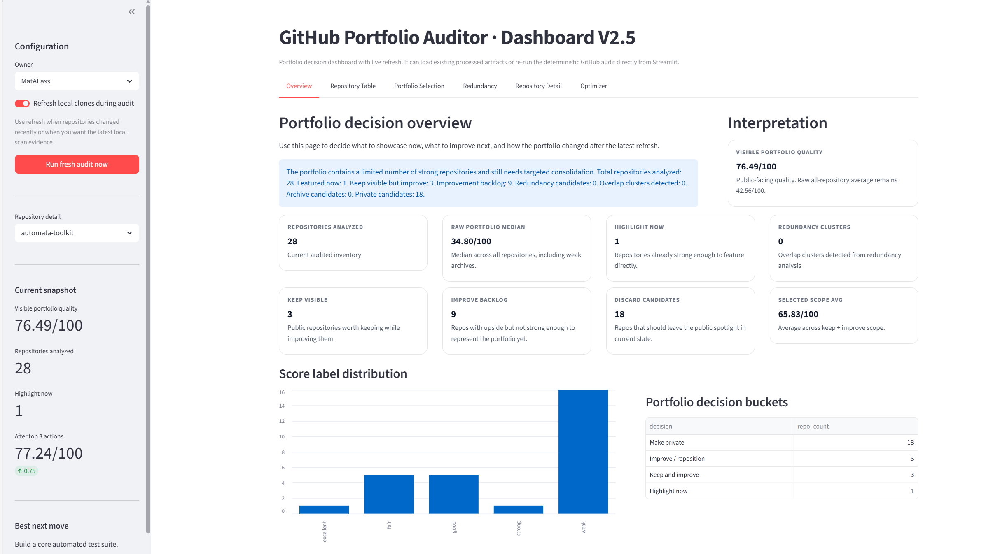
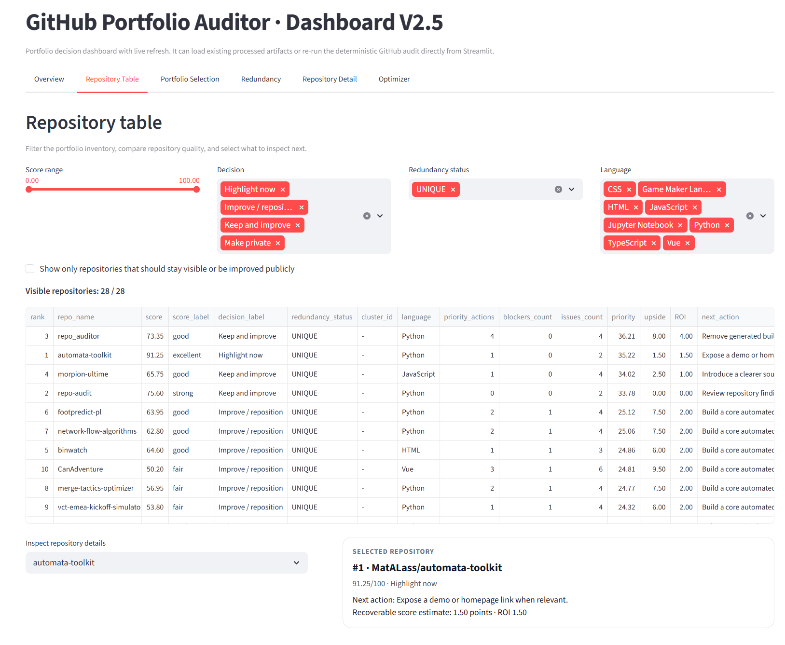
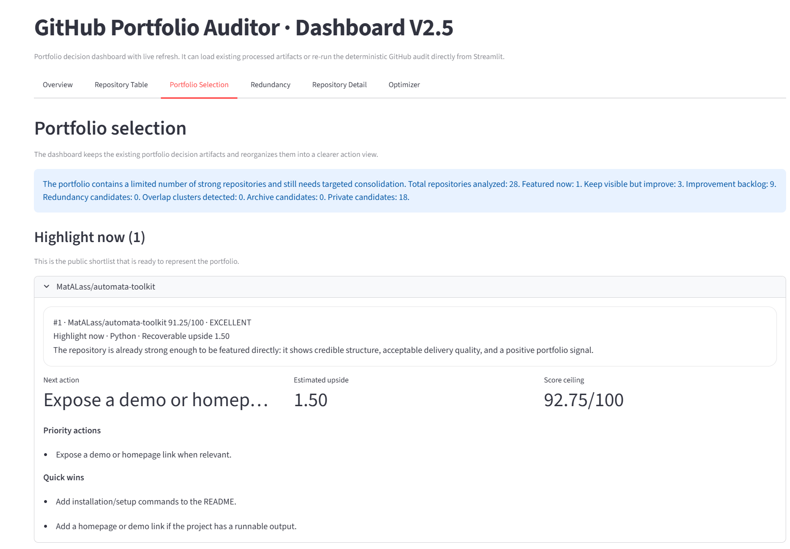
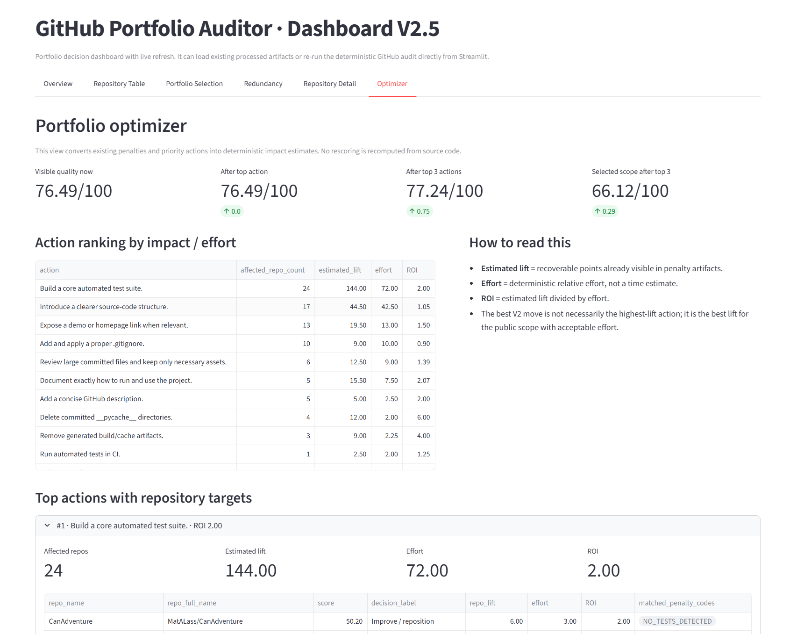

# GitHub Portfolio Auditor

A deterministic, policy-driven system to audit, score, and optimize a GitHub portfolio.

---

## 1. Context

When reviewing GitHub profiles, one recurring issue appears: there is no objective, structured way to evaluate the quality of a portfolio.

Most repositories:
- vary widely in quality
- lack clear positioning
- overlap in purpose
- fail to communicate technical depth

As a result, even strong candidates often present portfolios that underperform.

This project was built to solve that problem with a deterministic and explainable approach.

---

## 2. What this project does

GitHub Portfolio Auditor is a system that:

1. Collects repositories from GitHub
2. Scans each repository (structure, documentation, testing, CI, signals)
3. Scores them using a configurable policy
4. Generates deterministic reviews (no LLM dependency)
5. Ranks repositories for portfolio visibility
6. Recommends which repositories to:
   - feature
   - improve
   - merge
   - archive
   - make private
7. Provides a dashboard to explore and optimize decisions

---

## 3. Example workflow

1. Run an audit on a GitHub account
2. Get a scored and ranked list of repositories
3. Identify weak or redundant projects
4. Apply prioritized improvements
5. Re-run the audit and measure impact

---

## 4. Screenshots (to add)

### Portfolio overview


### Repository ranking and filtering


### Portfolio decision engine


### Optimization engine (ROI-based actions)


---

## 5. Architecture

The system is structured as follows:

src/
  portfolio_auditor/
    collectors/        GitHub API
    scanners/          repository analysis
    scoring/           policy-driven scoring
    reviewing/         deterministic review
    ranking/           ranking and selection
    dashboard/         Streamlit UI
    models/            domain models

tests/
  unit/
  integration/
  golden/             snapshot tests
  smoke/

docs/
  scoring_methodology.md
  portfolio_decision_rules.md

---

## 6. Key design principles

Deterministic first  
All outputs are reproducible and explainable.

Policy-driven  
Scoring rules are externalized in YAML.

Separation of concerns  
Scanning, scoring, reviewing and ranking are distinct layers.

Portfolio-oriented  
This is not a generic repo scorer, but a portfolio optimization tool.

---

## 7. Installation

```bash
git clone https://github.com/<your-username>/github-portfolio-auditor.git
cd github-portfolio-auditor

python -m venv .venv
.venv\Scripts\activate

pip install -e .[dev]
```

---

## 8. Configuration

Create a .env file:

```
GITHUB_TOKEN=your_token_here
```

---

## 9. Usage

Run audit:

```bash
portfolio-auditor --owner <username>
```

Run dashboard:

```bash
set PYTHONPATH=src;.
streamlit run src/portfolio_auditor/dashboard/app.py
```

---

## 10. Tests

```bash
pytest -q
pytest tests/golden -q
pytest tests/smoke -q
```

---

## 11. Code quality

```bash
ruff check .
```

---

## 12. Impact

This project enables:

- objective evaluation of a GitHub portfolio
- structured prioritization of improvements
- reduction of redundancy between projects
- stronger technical signaling
- measurable portfolio progression

It transforms a portfolio from a collection of repositories into a curated, intentional system.

---

## 13. Limitations

- heuristic-based scoring
- no empirical calibration yet
- redundancy detection is approximate
- dashboard depends on generated artifacts

---

## 14. Roadmap

- improve test coverage
- refactor large modules
- strengthen dashboard architecture
- introduce empirical calibration
- improve redundancy detection

---

## 15. Author

Mathieu  
Data / BI / Analytics Engineering
